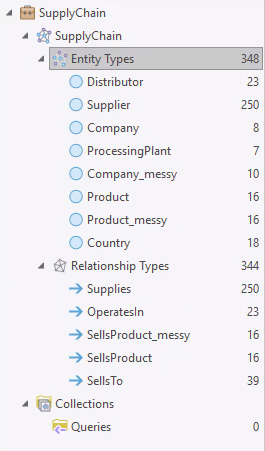

### Data descriptions
The SupplyChainGeodatabase.xml includes:
- Distributors
- ProcessingPlants
- Products
- Products_messy
- Suppliers

The <code>Assign Parts to Product.ipynb</code> file appends "clean values" to the Products table. Then, this table was exported to Products_messy and manually obscured. 

The ContextualDataGeodatabase.xml includes:
- HurricanePath
- HurricanePath_buffer
- weather_reports_nlp (generated at the end of demo 3B)

The SupplyChain folder that is the backed up knowledge graph has the following data model:

