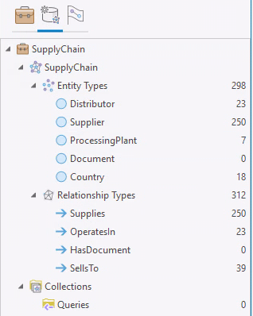
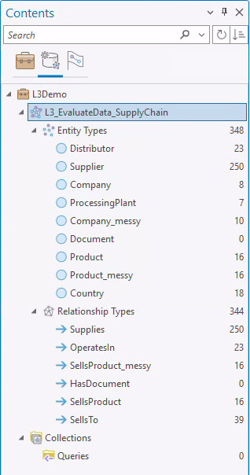
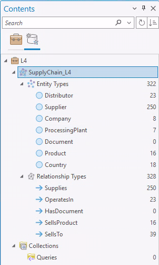

### Data descriptions
The SupplyChainGeodatabase.xml includes:
- Distributors
- ProcessingPlants
- Products
- Products_messy
- Products_messy_backup (this is incase this demo needs resivited in class, since you modify the other file in the demo)
- Suppliers

The <code>Assign Parts to Product.ipynb</code> file appends "clean values" to the Products table. Then, this table was exported to Products_messy and manually obscured. 

The ContextualDataGeodatabase.xml includes:
- HurricanePath
- HurricanePath_buffer
- weather_reports_nlp (generated at the end of demo 3B)

## Knowledge Graphs:
### L3_EvaluateData_SupplyChain
- Use this KG for the Lesson 3A demo. 
- This KG contains clean and messy entities added for Product, Company, and SellsProduct entities & relationships
- This is the Knowledge graph feeding the two mapx files used in the demo: Structured Data Evaluation (Messy).mapx & Structured Data Evaluation (Clean).mapx

### SupplyChain
- This is the KG to start Lesson 4 with. 
- It does not contain the Product, Company, and SellsProduct entities & relationships

### SupplyChain_EndL4
- This is the KG created by the end of the lesson 4 demo.

